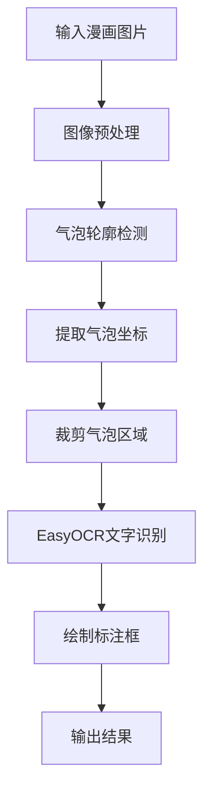

对于漫画图片，可以使用EasyOCR来识别气泡内的文字，并结合OpenCV等图像处理库来定位气泡坐标。下面我为你提供一个详细的实施方案和代码示例。

## 实施方案概述

整个方案主要分为两个核心步骤：**漫画气泡定位** 和 **气泡内文字识别**。基本流程如下：



## 具体代码实现

以下是完整的实现代码，包含了气泡检测和文字识别功能：

```python
import cv2
import numpy as np
import easyocr
import matplotlib.pyplot as plt
from PIL import Image

class ComicTextOCR:
    def __init__(self, languages=['ja', 'en']):
        """
        初始化漫画文字识别器
        
        参数:
            languages: 支持的语言列表，默认日语和英语
        """
        self.reader = easyocr.Reader(languages, gpu=False)  # 初始化EasyOCR
    
    def preprocess_image(self, image_path):
        """
        图像预处理：增强气泡与背景的对比度
        """
        # 读取图像
        image = cv2.imread(image_path)
        if image is None:
            raise ValueError(f"无法加载图像: {image_path}")
        
        # 转换为灰度图
        gray = cv2.cvtColor(image, cv2.COLOR_BGR2GRAY)
        
        # 使用高斯模糊减少噪声
        blurred = cv2.GaussianBlur(gray, (5, 5), 0)
        
        # 二值化处理 - 使用Otsu自适应阈值
        _, binary = cv2.threshold(blurred, 0, 255, cv2.THRESH_BINARY + cv2.THRESH_OTSU)
        
        return image, binary
    
    def detect_speech_bubbles(self, binary_image, original_image, min_area=1000):
        """
        检测漫画中的气泡区域
        """
        # 寻找轮廓
        contours, hierarchy = cv2.findContours(
            binary_image, 
            cv2.RETR_EXTERNAL, 
            cv2.CHAIN_APPROX_SIMPLE
        )
        
        bubbles = []
        bubble_coordinates = []
        
        for contour in contours:
            # 计算轮廓面积
            area = cv2.contourArea(contour)
            
            # 过滤掉太小的区域
            if area < min_area:
                continue
                
            # 获取轮廓的边界矩形
            x, y, w, h = cv2.boundingRect(contour)
            
            # 计算轮廓的圆形度（判断是否接近气泡形状）
            perimeter = cv2.arcLength(contour, True)
            if perimeter == 0:
                continue
                
            circularity = 4 * np.pi * area / (perimeter * perimeter)
            
            # 基于面积和圆形度筛选气泡
            if area > min_area and circularity > 0.3:
                bubble_roi = original_image[y:y+h, x:x+w]
                bubbles.append({
                    'roi': bubble_roi,
                    'coordinates': (x, y, w, h),
                    'contour': contour
                })
                bubble_coordinates.append((x, y, w, h))
        
        return bubbles, bubble_coordinates
    
    def extract_text_from_bubble(self, bubble_roi):
        """
        从气泡区域提取文字
        """
        try:
            # 使用EasyOCR识别文字
            results = self.reader.readtext(bubble_roi, detail=1)
            return results
        except Exception as e:
            print(f"文字识别错误: {e}")
            return []
    
    def process_comic_image(self, image_path, output_path=None):
        """
        处理漫画图像：检测气泡并识别文字
        """
        # 图像预处理
        original_image, binary_image = self.preprocess_image(image_path)
        result_image = original_image.copy()
        
        # 检测气泡
        bubbles, bubble_coordinates = self.detect_speech_bubbles(binary_image, original_image)
        
        print(f"检测到 {len(bubbles)} 个气泡")
        
        all_results = []
        
        # 处理每个气泡
        for i, bubble in enumerate(bubbles):
            x, y, w, h = bubble['coordinates']
            
            # 提取文字
            text_results = self.extract_text_from_bubble(bubble['roi'])
            
            # 在结果图像上绘制气泡边界框
            cv2.rectangle(result_image, (x, y), (x + w, y + h), (0, 255, 0), 2)
            
            bubble_texts = []
            # 处理识别到的文字
            for text_info in text_results:
                bbox, text, confidence = text_info
                
                if confidence > 0.3:  # 置信度阈值
                    # 转换文字坐标到原图坐标系
                original_bbox = []
                for point in bbox:
                    px, py = point
                    original_bbox.append([px + x, py + y])
                
                # 绘制文字边界框
                pts = np.array(original_bbox, np.int32)
                cv2.polylines(result_image, [pts], True, (255, 0, 0), 2)
                
                # 添加文字标签
                cv2.putText(result_image, text, (x, y-10), 
                          cv2.FONT_HERSHEY_SIMPLEX, 0.7, (0, 0, 255), 2)
                
                bubble_texts.append({
                    'text': text,
                    'confidence': confidence,
                    'bbox': original_bbox
                })
                
                print(f"气泡 {i+1}: 文字='{text}', 置信度={confidence:.2f}")
            
            all_results.append({
                'bubble_id': i+1,
                'coordinates': (x, y, w, h),
                'texts': bubble_texts
            })
        
        # 保存或显示结果
        if output_path:
            cv2.imwrite(output_path, result_image)
            print(f"结果图像已保存: {output_path}")
        
        # 显示结果
        self.display_result(original_image, result_image)
        
        return all_results, result_image
    
    def display_result(self, original_image, result_image):
        """
        显示原始图像和结果图像
        """
        plt.figure(figsize=(15, 10))
        
        plt.subplot(1, 2, 1)
        plt.imshow(cv2.cvtColor(original_image, cv2.COLOR_BGR2RGB))
        plt.title('原始图像')
        plt.axis('off')
        
        plt.subplot(1, 2, 2)
        plt.imshow(cv2.cvtColor(result_image, cv2.COLOR_BGR2RGB))
        plt.title('检测结果')
        plt.axis('off')
        
        plt.tight_layout()
        plt.show()

# 使用示例
if __name__ == "__main__":
    # 初始化OCR处理器
    comic_ocr = ComicTextOCR(languages=['ja', 'en'])  # 日语和英语
    
    # 处理漫画图像
    image_path = "comic_image.jpg"  # 替换为你的图像路径
    output_path = "result_image.jpg"
    
    try:
        results, result_image = comic_ocr.process_comic_image(image_path, output_path)
        
        # 打印详细结果
        print("\n" + "="*50)
        print("识别结果汇总:")
        print("="*50)
        
        for result in results:
            print(f"气泡 {result['bubble_id']}:")
            print(f"  坐标: (x={result['coordinates'][0]}, y={result['coordinates'][1]}, "
                  f"宽={result['coordinates'][2]}, 高={result['coordinates'][3]})")
            if result['texts']:
                for text_info in result['texts']:
                    print(f"  文字: '{text_info['text']}' (置信度: {text_info['confidence']:.2f})")
            else:
                print("  文字: 未识别到文字")
            print()
            
    except Exception as e:
        print(f"处理错误: {e}")
```

## 关键参数说明

### 气泡检测参数调整
根据你的漫画风格，可能需要调整以下参数：

```python
# 在 detect_speech_bubbles 方法中调整这些参数：

# 最小面积阈值 - 过滤太小的区域
min_area = 1000  # 根据图像大小调整

# 圆形度阈值 - 控制形状筛选严格程度
circularity > 0.3  # 值越小接受更多不规则形状

# 二值化阈值 - 在preprocess_image中调整
_, binary = cv2.threshold(blurred, 0, 255, cv2.THRESH_BINARY + cv2.THRESH_OTSU)
```

### EasyOCR参数优化
```python
# 初始化时可以调整的参数
reader = easyocr.Reader(
    languages=['ja', 'en'],  # 语言选择
    gpu=False,               # 是否使用GPU
    model_storage_directory=None,  # 模型存储目录
    download_enabled=True    # 是否自动下载模型
)

# 文字识别时的参数
results = self.reader.readtext(
    bubble_roi, 
    detail=1,               # 返回详细信息
    paragraph=False,        # 是否分段
    batch_size=10,          # 批处理大小
    contrast_ths=0.1,       # 对比度阈值
    adjust_contrast=0.5     # 对比度调整
)
```

## 安装依赖

在运行代码前，需要安装以下依赖包：

```bash
pip install opencv-python numpy easyocr matplotlib pillow
```

## 处理不同风格的漫画

对于特殊的漫画风格，你可能需要：

1. **传统日式漫画**：使用日语语言包 `['ja']`
2. **美式漫画**：使用英语语言包 `['en']`
3. **多语言漫画**：使用 `['ja', 'en']` 或相应语言
4. **黑白/彩色漫画**：调整二值化阈值参数

## 注意事项

1. **首次运行**时会下载相应的语言模型，需要网络连接
2. **气泡检测效果**取决于漫画的艺术风格，可能需要调整轮廓检测参数
3. **文字识别精度**受图像质量和文字清晰度影响
4. **复杂背景**可能会干扰气泡检测，需要更复杂的预处理

这个方案应该能够有效地检测漫画中的气泡并识别其中的文字。你可以根据具体的漫画风格调整参数以获得最佳效果。